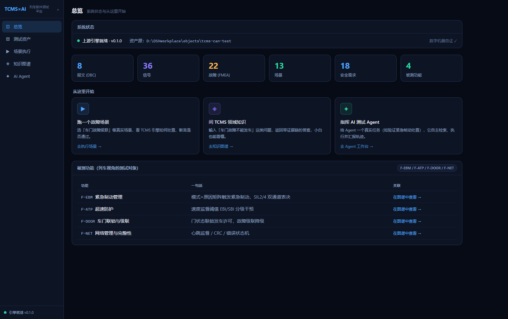

# TCMS × AI 测试平台（tcms-ai-platform）

> 把「AI 测试工程师能干活、能自证、看得见」的 TCMS 列车控制软件测试平台，
> 做成**本地 Web 应用**。数据全部派生自真实上游资产，AI 能力离线可用。



更多页面截图：本地运行 `node e2e/preview-shots.mjs` 生成（见 docs/preview/）。

## 新人 3 步跑起来（不用配任何 key）

```bash
# 1. clone
git clone https://github.com/zych2002918/tcms-ai-platform.git
cd tcms-ai-platform

# 2. 启动（Windows）
start.bat

# 2'. 或 macOS / Linux
bash start.sh
```

脚本会自动：建虚拟环境 → 装依赖 → 启动服务 → 自动打开浏览器。
**首次较慢（装依赖），之后秒开。**

### 免安装：Windows exe（给现场 / 不会配环境的人）

> 打包方法见 `packaging/README.md`；发布产物即整个 `dist/tcms-ai-platform/` 目录，
> 双击 `tcms-ai-platform.exe` 即可（免 Python、免引擎、前端已内置，自动开浏览器）。

## 新手引导 + 外部可配置接口（设置页）

打开后右上/导航「**设置 / 引导**」有 4 步新手向导：资产源 → 接入 AI → 检查引擎 → 完成。

- **资产源**：默认用内置快照可直接开始；也可填自己的 tcms-can-test 目录
  （往 `tcms/faults.yaml` 加故障、往 `scenarios/` 加场景 = 自定义用例/故障/情景）。
- **接入 AI（可选）**：阿里云百炼 / DeepSeek 官方 / 任意 OpenAI 兼容端点。
  不填也能用（Agent 离线 Mock 全流程可演示）。
- **API key 安全**：只写入本机 `~/.tcms-ai-platform/settings.json`（gitignore 之外），
  响应/日志/仓库绝不含 key；「清除 key」一键删除。

### 手动启动（可选）

```bash
python -m venv .venv
.venv/Scripts/activate            # Windows；Linux/macOS: source .venv/bin/activate
pip install -e .                  # 或 pip install -e ".[upstream]" 带引擎
python -m tcms_ai_platform.server.app   # → http://127.0.0.1:8000
```

## 回答你的几个"为什么"

### 为什么要一个端口 / 这是不是要部署到服务器？
**不需要服务器。** 平台是**本地 Web 应用**：Python 起一个本地服务（默认
`http://127.0.0.1:8000`），浏览器访问——跟你打开 VS Code 一样，是跑在你
自己机器上的程序，不对外网开放。端口只是本机内部通信的"门牌"。

### 下载后别人怎么运行？
见上方"新人 3 步"。关键设计：
- **平台自带资产快照**（DBC/故障字典/19 场景/RTM 随包分发），clone 单仓库即可加载全部资产；
- 启动脚本自动建 venv、装依赖，无需手工配环境；
- 可选的 TCMS 引擎（`.[upstream]`）用于场景执行/Agent，不装则资产浏览与知识图谱仍完整可用；
- `start.bat` / `start.sh` 是唯二需要用户执行的命令。

### 新人要不要填自己的 API？
**当前不用。** Agent 默认走**离线 Mock 后端**——检索知识、选场景、真实执行、
给评分报告这条链路**不花一分钱、不需要任何 key**。只有将来启用"真 LLM
写测试/自由规划"这类功能才需要 key（`pip install -e ".[llm]"` + 配
`.env` 的 key），且是可选增强而非前提。

## 界面与功能

- **总览** — 系统状态 + 从这里开始（看故障演示 / 跑场景 / 问图谱 / 指挥 Agent）；
  六大资产卡（报文/信号/故障/场景/需求/功能）**点击直达**测试资产页对应内容
- **设置 / 引导** — 新手向导 + **扩展与集成**面板（自定义资产 / API / 环境变量键值表 /
  能力矩阵 / key 本机安全存储），外部可配置接口一目了然
- **测试资产** — 报文 · 信号（枚举）· 故障（FMEA 详情）· 安全需求（RTM）· 场景 · 被测功能，
  可筛选；支持 `?tab=` / `?focus=` URL 直达指定条目
- **场景执行** — 在真实 TCMS 引擎上运行故障场景，逐步流程 + 断言证据；
  场景数来自当前资产源（机器自证）；**手动编排**模式可自己编排
  「何时注入什么故障 → 期望什么处置」并真实执行
- **故障演示（FaultLab）** — 把真实故障场景变成**可播放的动画**：注入 → 检测 →
  处置 → 恢复。列车状态、故障部位高亮、驾驶台仪表、速度/制动缸压力曲线随时间轴
  同步推进（拖动进度条即暂停，便于停在关键瞬间观察）。每个事件都可溯源——
  页内「数据管线 · 引擎观察窗」透明展示场景 YAML / 故障字典 / 引擎断言 / 示意物理模型。
- **知识图谱** — 大白话检索 TCMS 领域知识（图谱 + 向量双通道），结果分类 + 附小白解释 +
  关系图谱；**「这张图谱给谁用」**说明条 + 图例 + 深度 1/2/3 切换（给人看证据链，给 AI 喂 RAG）
- **AI Agent 工作台** — 给 Agent 真实任务（紧急制动 / 超速 / 心跳丢失 / 总线短路 /
  CRC / 重启风暴…8 类），看它**检索到的证据链** → 决策 → 真实执行 → 汇报（轨迹可审计 + 真实语义评审）；
  也支持**自由目标**：用大白话输入「车门故障了还能发车吗」，Agent 先理解锚定真实故障再查证，
  执行过程以**步骤管线动画**实时展示（规划 → 检索 → 执行 → 验证 → 汇报）

## 启动前自检

```bash
python -m tcms_ai_platform.cli      # 或: tcms-platform-doctor
```
逐项检查：Python / 依赖 / 资产源 / TCMS 引擎 / LLM key / 端口。

## 配置（.env，全部可选）

见 `.env.example`。核心变量：
- `PORT` — 端口，默认 8000
- `TCMS_UPSTREAM_DIR` — 用活的上游 tcms-can-test 目录（可选，默认内置快照）
- `DASH_API_KEY` / `DEEPSEEK_API_KEY` / `LLM_API_KEY` — 真 LLM 用（可选）

### 配置优先级

环境变量 > 设置文件（`~/.tcms-ai-platform/settings.json`，经「设置/引导」页写入）> 内置默认。
用设置文件最省事：不用碰终端、不泄漏到仓库、exe 同样支持。

## 架构

```
真实资产(tcms-can-test) ──loader──▶ L1 资产模型 ──FastAPI──▶ Web UI (/)
        (内置快照/活上游/兄弟目录 三级解析)
        ├──▶ 知识底座：图谱(221节点/342边) + 向量(216文档) + GraphRAG
        │        ├─ 资产实体(报文/信号/故障/场景/需求/功能)
        │        └─ 领域知识注入(驾驶模式/联锁/阈值/机制/危害/标准/概念)
        │            └─ 故障→危害 深连(16边，全部溯源真实 hazard 条目)
        ├──▶ FaultLab：真实场景 → 事件时间线 + 通道曲线(动画演示)
        └──▶ Agent Harness：任务库(8真实故障) → GraphRAG 检索(证据链可见)
                 → 真实执行 → 验证 → 反思自愈 → 6维语义评审
```

## 测试 / 门禁

```bash
python -m pytest tests -q            # 53 tests（含真实资产冒烟）
python -m ruff check src tests
python -m pytest tests -q --cov=tcms_ai_platform --cov-fail-under=80
```

> 红线：展示数字全部由真实资产派生；功能表/任务库锚定真实 RTM/故障字典，漂移即失败。
